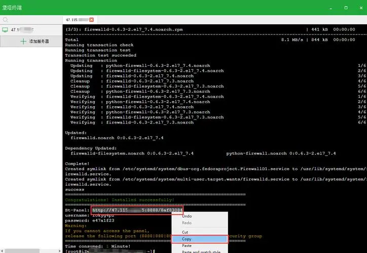
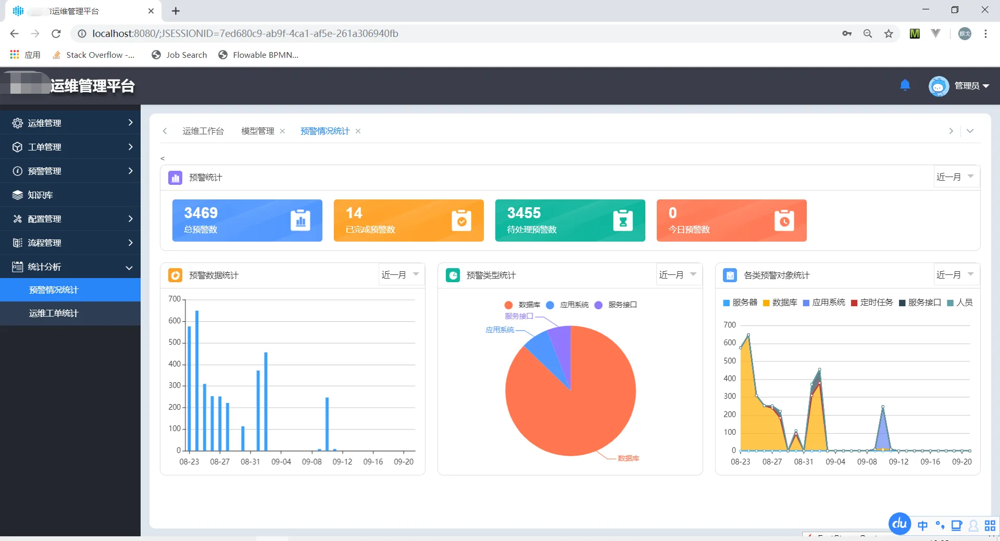

### V0.1  
引用《产品文档v0.1》，目标时间 20221024
- 需求分析
- 产品设计
- 架构设计
- 通讯协议设计
- 服务器监控基本功能实现： 超过监控规则则进行报警通知
- CI/CD 基本功能实现： 基于docker容器的，基于可执行文件的
- docker管理基本功能实现：镜像相关操作，容器相关操作
- 服务器在线操作基本功能实现：操作服务器进程，增删改查环境变量，执行命令
- 网关服务基本功能实现：L4
- “主页“ 基本功能实现：页面
- “Slave“ 基本功能实现：页面
- “Task“ 基本功能实现：页面
- “项目“ 基本功能实现：页面
- “Docker管理” 基本功能实现：页面
- “可执行文件管理” 基本功能实现：页面
- “网关管理” 基本功能实现：页面
- “缓存管理” 基本功能实现：页面
- “监控管理” 基本功能实现：页面
- 记录操作功能
- 服务器host管理
- 测试并修复优先级高的bug
- 《使用手册v0.1》

### v0.2
目标时间  20221111
- 修复v0.1优先级的bug
- 自动创建配置的目录与文件
- UI优化与升级
- “环境部署” 一键安装与部署卸载docker环境
- “环境部署” 一键安装与部署卸载nginx环境
- “网络代理” http/s代理
- “网络代理” socket5代理
- “网络代理” TCP转发
- “Slave” 部署二进制程序
- “Slave” 软件部署
- “Slave目录&文件” 页面与目录查看
- 在线终端(web终端)
- “主页” 远程操作功能(web终端)
- slave 版本号
- 项目网关放到项目
- 测试并修复优先级高的bug
- 《使用手册v0.2》

### v0.3
目标时间   20221130
- 修复v0.2优先级的bug
- review code， 并增加注释
- UI优化与升级
- 清除Token,退出登录状态
- 需要在首页服务器列表增加系统运行时间
- 操作记录 倒叙翻页
- 设置页面
- monitor采集的性能文件,定时清旧数据
- “Slave目录&文件” 查看文件内容
- “Slave目录&文件” 导出文件
- “Slave目录&文件” 上传文件
- “Slave目录&文件” 创建目录
- “Slave目录&文件” 打包下载整个目录
- “Slave目录&文件” 解压文件
- “nginx管理” nginx在线管理页面与读取配置等操作
- “nginx管理” 重启，启动，暂停，杀掉 等操作性功能
- docker容器 Volumes 映射到指定路径
- 测试并修复优先级高的bug
- [TODO]《使用手册v0.3》
- [TODO] 用于生产环境 testing

### v0.4
目标时间  20221230
- [TODO]修复v0.3优先级低的bug
- [TODO]review code
- [TODO]UI优化与升级
- [TODO]"用户安全"定期更新账号密码 
- [TODO]"用户安全"白名单 
- [TODO]”通讯安全“master 与 slave 通讯安全方案（ 非对称加密 ）
- [TODO]代理和转发的监听和恢复
- [TODO]报警知晓的功能, 点击知晓不计数报警
- [TODO]在线Slave（服务器）日志分析
- [TODO]master集群
- [TODO]登录黑白名单 (考虑)
- [TODO]通讯安全机制
- [TODO]master&slave 数据传输安全方案， 对数据包加密
- [TODO]服务器iptables管理 （需要学习iptables相关知识）
- [TODO]社区
- [TODO]监控细化精确到进程
- [TODO]内网穿透
- [TODO]“监控” 设置邮件通知
- [TODO]“监控” 设置钉钉通知
- [TODO]“网络代理” UDP转发
- [TODO]“网络代理” ssh代理
- [TODO]“环境部署” 一键安装与部署golang开发环境
- [TODO]“环境部署” 一键安装与部署python开发环境
- [TODO]“环境部署” 一键安装与部署java开发环境
- [TODO]在线编程
- [TODO]监控图表-时间段选择
- [TODO]项目事件记录
- [TODO]“网关” 新建项目网关
- [TODO]docker项目的删除
- [TODO]测试并修复优先级高的bug
- [TODO]《使用手册v0.4》

### v0.5
目标时间   20230130
- [TODO]修复v0.4优先级低的bug
- [TODO]社区
- [TODO]CDN servers
- [TODO]测试并修复优先级高的bug
- [TODO]《使用手册v0.5》

### v0.6
目标时间   20230228

云端终端 参考

预警页面 参考

插件模式，Mysql工具  Redis工具  等

