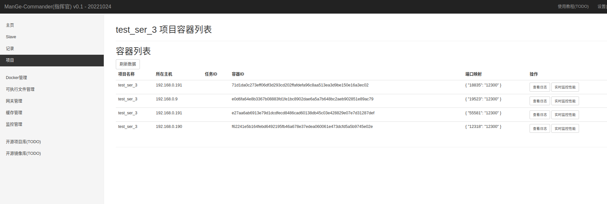
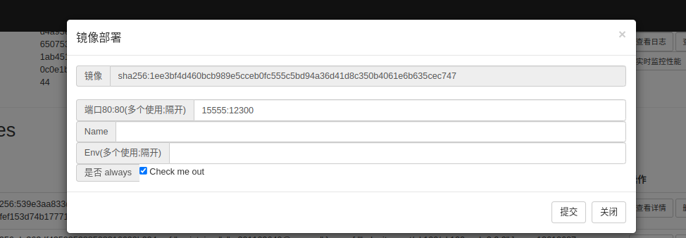

# ManGe Commander (指挥官)

#### 作者: 李漫
#### 产品所有人: 李漫

#### 主页: [mange.work](mange.work)

#### 邮箱: 2912882908@qq.com

## 一、 版本
20221024
- 发布版本 v0.1
- 文档版本 v0.1
- 内部版本 v0.1.20221024

## 二、 简介
> ManGe Commander 是轻量级一站式DevOps平台，是持续部署、持续集成的解决方案，也是服务器管理、
> 操作、监控的解决方案,同时集成了Docker管理。
> 

#### 定位
- 运维工具
- 部署软件
- 开发相关软件
- 服务器管理工具
- Docker管理工具

#### 产品目的
- 提升运维效率
- 降低多服务器管理成本
- 低学习成本快速上手并使用
- 提升部署效率
- 精准监控与报警系统
- 开发相关软件集成提升开发工作效率


## 三、 架构介绍
> 功能架构: 采用master/slave机制,master一对多的管理slave,为了高可用master支持集群；

> master: 主要功能是提供操作界面(web UI)，分发任务到slave，收集并分析slave上报的采集服务器数据进行监控，下发服务器的操作指令，网络地址注册中心等

> slave: 主要功能是守护进程，docker操作，系统操作，采集服务器的性能数据，自动维护项目等

> master与salve间的通讯: 数据交互使用UDP+TCP 实现的自定义通讯协议， 下载上传文件使用http/s协议

> 功能架构图:
    


> 网关: L4负载均衡，网络转发与代理(连接复用+池化技术+SO_REUSEPORT，中转耗时<1ms,抗高并发); 黑白名单,ip限流;应用场景:水平扩展微服务等等.

> 网关架构图:


## 四、 应用场景

- 服务器监控
- CI/CD
- docker管理
- 服务器可执行文件部署与进程管理
- 服务器在线操作
- 网关服务
- [TODO]基于P2P分布式存储 
- [TODO]NAT penetration(内网穿透)
- [TODO]CDN servers
- [TODO]Proxy IP servers 管理中心
- [TODO]Web TTY 

## 五、 下载地址
- master
  
  |  日期   | 版本  | 地址  | 版本说明| 支持平台| 
  |  ----  | ----  | ----  | ----  | ----  | 
  |  20221024 | v0.1 | mange.work | v0.1 见里程碑| linux/unix, windows, MACOS |
  

- slave 

  |  日期   | 版本  | 地址  | 版本说明| 支持平台|
  |  ----  | ----  | ----  | ----  | ----  | 
  |  20221024 | v0.1 | mange.work| v0.1 见里程碑| linux/unix, MACOS, windows(doing) |

## 六、 使用说明篇

### 1. 部署

#### 部署Master

下载并在Master服务器上执行 ./master 即可


配置文件说明
```bigquery
# http server 端口
httpServer:
  prod: 18888

# udp server 端口
udpServer:
  prod: 16666

# tcp server 端口
tcpServer:
  prod: 17777

# 可执行文件保存路径
exeStoreHousePath: "/media/data/exeStoreHouse"

# 项目的可执行文件保存路径
projectPath: "/media/data/projectPath"

# JWT  secret & expire
jwt:
  secret: asdasd786251ashdgjdbd
  expire: 86400

# 数据持久化保存路径
# data 常规数据持久化
# performance 性能采集持久化
dbPath:
  data: "/media/data/master_db/data.db"
  performance: "/media/data/master_db/performance.db"
```

#### 部署Slave

例如： 拥有四台服务器， 192.168.0.9, 192.168.0.190, 192.168.0.191, 192.168.0.192

1. 下载 slave_linux, 分别上传到每个服务器上
```bigquery
root@mange-PC:/home/mange# scp -r 'slave_linux_v0.1.2' 192.168.0.190:/home/
root@192.168.0.190's password: 
slave_linux                                                                                        100%   12MB  39.7MB/s   00:00    
configs.yaml                                                                                       100%  485   462.0KB/s   00:00    
root@mange-PC:/home/mange# scp -r 'slave_linux_v0.1.2' 192.168.0.191:/home/
root@192.168.0.191's password: 
slave_linux                                                                                        100%   12MB  39.9MB/s   00:00    
configs.yaml                                                                                       100%  485   453.8KB/s   00:00    
root@mange-PC:/home/mange# scp -r 'slave_linux_v0.1.2' 192.168.0.192:/home/
root@192.168.0.192's password: 
slave_linux                                                                                        100%   12MB  61.5MB/s   00:00    
configs.yaml                                                                                       100%  485   543.4KB/s   00:00    
root@mange-PC:/home/mange# 

```

2. 在各个服务器上修改配置  configs.yaml
```bigquery
# master UDP 通讯地址
master:
  host: 192.168.0.9
  port: 16666

# master HTTP通讯地址
masterHttp: "http://192.168.0.9:18888"

# 可执行文件保存路径
exeStoreHousePath: "/home/exeStoreHousePath_Linux/"

# 可执行文件日志保存路径
exeStoreHouseLogs: "/home/exeStoreHouseLogs/"

# 项目的可执行文件保存路径
projectExeStoreHousePath: "/home/projectExeStoreHousePath_Linux/"

# 数据持久化保存路径
dbPath:
  data: "/home/slave_linux_db/data.db"
```

3. 执行 ./slave_linux
```bigquery
看见日志有打印主机信息则启动成功

2022-10-19 22:24:35 |Info  |f=slave_linux/handler/host.go:48 | 主机名称 = node1
2022-10-19 22:24:35 |Info  |f=slave_linux/handler/host.go:51 | 系统平台 = linux
2022-10-19 22:24:35 |Info  |f=slave_linux/handler/host.go:54 | 系统版本 os_name+版号 = Linux version 3.10.0-1160.45.1.el7.x86_64 (mockbuild@kbuilder.bsys.centos.org) (gcc version 4.8.5 20150623 (Red Hat 4.8.5-44) (GCC) ) #1 SMP Wed Oct 13 17:20:51 UTC 2021
2022-10-19 22:24:35 |Info  |f=slave_linux/handler/host.go:57 | 系统架构 = amd64
2022-10-19 22:24:35 |Info  |f=slave_linux/handler/host.go:60 | CPU核心数 = 8核
2022-10-19 22:24:35 |Info  |f=slave_linux/handler/host.go:63 | CPU name = Intel(R) Xeon(R) CPU           E5606  @ 2.13GHz

```

4. 在master 首页上可见到Slave(服务器的信息)


### 2. 登录与安全

- web操作界面安全方案
1. 定期更新账号密码 TODO
2. 记录操作  TODO
3. 记录请求  TODO
4. 白名单  TODO
5. 暴力登录检验，一个ip只有五次试错机会，超过拉黑ip

- master 与 slave 通讯安全方案
1. 非对称加密 TODO

> 首次启用master会到注册界面(账号只注册一次，数据持久在 db文件，重置db文件等用于恢复出厂设置)，见图:


> 登录界面进行登录，采用无状态登录JWT方案，见图:


> 登录错误超过限制次数， 见图:


> 登录成功后跳转到首页


### 3. 主页
> 首页分为功能图标区域与Slave列表;
> 
> 【Slave(服务器)数量】 ： 显示总服务器数量与在线服务器数量，点击进入【Slave】页面
> 
> 【项目数量】 ： 显示当前已经创建并运行的项目数量，点击进入【项目】页面
> 
> 【报警数量】 ： 显示当前报警的数量，报警来自于各个主机的性能超过监控指标和各个异常的提示，点击进入【监控管理】
> 
> 【网关数量】 ： 显示当前部署的网关数量，这里的网关是“commander“自带的，主要用于网络转发代理负载均衡，是基于L4的，点击进入【网关】
>
> 【可执行文件】 ： 显示当前可执行文件数量，这里的可执行文件是上传到master的可执行文件，可以对可执行文件进行指定部署，监控，管理，在线修改配置等操作，点击进入【可执行文件管理】
>
> 【Docker】 ： 该按钮点击可进入【Docker管理】
>
> 【使用手册(TODO)】 ： 点击访问mange.work的“commander”的社区->在线使用文档
> 
> 【社区(TODO)】 ： 点击访问mange.work的“commander”的社区
> 
> 【ManGe主页】 ： 点击访问mange.work
> 
> Slave(服务器) 列表： 显示slave的基本信息，与加载页面时Slave采集的性能值CPU与MEM，还有操作按钮点击直接执行对其含义的功能。


### 4. Slave
> 服务器的可视化面板操作界面，可以在线操作和管理服务器，如图:


- 【进程列表】 :  能查看进程信息与操作进程，如图:


- 【端口使用列表】 :  能查看端口使用信息与操作占用端口的进程，如图:


- 【环境变量】 : 能查看环境变量(TODO:在线增删改查系统环境变量)，如图:


- 【Docker管理】 : 进入该服务器的docker管理界面，如果服务未部署则没有任务信息，如图:


- 【Hosts管理】 ： 在线修改hosts文件，如图:


- 【实时性能监控】 ： 可以实时监控服务器性能


### 5. 记录
> 任务列表和操作记录， 如图：


### 6. 项目
>  项目是"commander"的特色功能，也是最核心的功能。

##### 功能
1. 部署可执行文件到指定主机
2. 调度管理基于容器的项目，将镜像部署到多个或指定主机上
3. 金丝雀发布更新镜像版本
4. 通过"commander"自带网关功能代理与负载容器
5. CI/CD
6. 水平扩展副本，减少副本

- 项目管理界面, 项目可以理解为k8s的“Deployments”, 如图:


- 【新建Docker容器项目】 : 
  
  网关转发原则: 网关端口 -> 注册中心(容器随机映射的端口) -> 容器端口

  故: 
  
    【网关服务端口映射】 网关端口:容器端口     

    【项目占用端口】 *:容器端口(容器端口映射则是随机)

   如下图，部署一个web服务,创建4个副本，会均匀部署到所有在线的Slave，web服务端口是12300, 创建一个网关代端口是12225部署到192.168.0.9上


- 部署成功后如下图


- 访问 192.168.0.9:12225 

- 【查看容器列表】 ： 可以看到项目所有容器的信息



- 现在需要升级镜像到v2版本，点击【更新镜像】，如图


- 更新成功后，访问 192.168.0.9:12225

- 【更改副本数量】 ： 可以水平扩展容器或减少容器数量，这里的容器分布都是均匀分布到各个Slave(服务器)上，如图


- 验证可以查看 【查看容器列表】

- 【查看容器列表】 上可以查看容器日志点击【查看日志】， 如图


- 【查看容器列表】 上可以实时监控容器性能点击【实时监控性能】， 如图


- 【查看网关】 点击可以进入【网关管理页面】

### 7. Docker 管理
> 能对docker进行远程管理
- Docker基础信息
  


- Docker容器列表


- Docker镜像列表

  
  
- 部署容器 : 例如部署一个nginx 

  


- 拉取镜像


- 容器 - 查看容器详情


- 容器 - 停止 与 停止并删除 容器


- 容器 - 查看容器日志


- 容器 - 查看进程


- 容器 - 修改容器名称


- 容器 - 重启容器

- 容器 - 实时监控容器


- 镜像 - 查看详情


- 镜像 - 部署这个镜像



### 8. 可执行文件管理
> 顾名思义就是在一个指定的服务器上部署可执行文件
> 
> "commander" 规定: 可执行文件进行压缩上传(zip,rar)，规定必须含有可执行文件，可含有相关配置文件，相关扩展目录等。

- 页面


- 新建可执行文件


- 进入目录结构


- 修改配置文件


- 部署执行


- 运行列表 - 查看日志


### 10. 网关管理
> "commander"自带网关，主要用于转发，负载， LVS是L4
> 
> 未来TODO: 创建，管理，黑白名单，手动转发，拦截，防御，安全，内网穿透, p2p桥接 等功能
> 
> 页面如下: 


### 11. 缓存管理
> "commander" 数据持久化是自带嵌入式数据库，无需第三方数据库。
> 
> 该功能主要提供，持久化数据重置删除
> 
> "commander" 数据持久化配置 , master配置文件 configs.yaml
```bigquery
# 数据持久化保存路径
# data 常规数据持久化
# performance 性能采集持久化
dbPath:
  data: "/media/data/master_db/data.db"
  performance: "/media/data/master_db/performance.db"
```


### 12. 监控管理
> 对各个Slave(服务器)进行监控与监控指标设置
> 
> "commander"的报警通知方案: 在线使用websocket, 离线使用邮件或钉钉
> 

- 页面


- 创建监控规则


- 修改监控规则

点击监控标准列表的【修改】即可


### 13. 开源项目库
> 可以理解为是一个远程的可执行文件仓库

TODO ...

### 14. 开源镜像库
> 可以理解为是一个远程的Docker镜像仓库

TODO ...


## 七、 场景篇

###  CI/CD

1. 创建一个项目， 4个副本，会均匀部署到所有在线的Slave，web服务端口是12300, 创建一个网关代端口是12225部署到192.168.0.9上， 如下图:


2. 部署成功后如下图


3. 访问 192.168.0.9:12225

4. 查看容器列表, 可以看到项目所有容器的信息


5. 现在需要升级镜像到v2版本，点击【更新镜像】，如图


6. 更新成功后，访问 192.168.0.9:12225


###  服务水平扩展

1. 更改副本数量, 可以水平扩展容器或减少容器数量，这里的容器分布都是均匀分布到各个Slave(服务器)上，如图


2. 验证可以查看 【查看容器列表】

###  执行爬虫程序
1. 将爬虫程序编辑成可执行文件
2. 与配置文件一起打包到压缩文件
3. 在 【可执行文件管理】页面新建可执行文件


4. 点击部署执行


5. 也可以查看日志

6. 也可以进入目录修改配置文件，再次部署执行


7. 结果: 


### 实现在线编程

TODO... 后面版本开发


## 八、 商业篇(20221024拟定)
1. 目前 ManGe Commander 发布版本都是社区版，项目目前不对外开源，如果后期有收益才会开源；
2. ManGe Commander 永久支持免费的社区版，项目开源由收益决定；收益方案分为出售与项目维护基金会；
3. 商业合作联系: 18483663083(李漫)；
4. 商业版以出售技术的形式转让给第三方，但无法破坏社区版永久免费的规定；
5. 项目基金维护会： 以使用者捐赠的形式捐赠给项目基金维护会，项目基金维护会所有人是李漫(18483663083)，基金由李漫待管理，用于项目的维护和迭代；
6. 未来畅想1: 为了项目持久发展与创新，未来一定会开源，邀请各路开发大佬加入这个项目，做大做强；
7. 未来畅想2: 由于是有一定收益才会开源，能走到开源这一步说明该项目是具有一定的价值，开源后参与项目维护和迭代的大佬也会得到相应的报酬，才有利于
   项目的长久发展。
8. 个人开发项目群: ...
9. ManGe Commander 社区版交流群: .....

## 九、 参考
- k8s
- docker
- Jenkins
- nginx L4


## 十、 版本里程碑

> 提供参考，计划赶不上变化

### V0.1
目标时间 20221024
- 需求分析
- 产品设计
- 架构设计
- 通讯协议设计
- 服务器监控基本功能实现： 超过监控规则则进行报警通知
- CI/CD 基本功能实现： 基于docker容器的，基于可执行文件的
- docker管理基本功能实现：镜像相关操作，容器相关操作
- 服务器在线操作基本功能实现：操作服务器进程，增删改查环境变量，执行命令
- 网关服务基本功能实现：L4
- “主页“ 基本功能实现：页面
- “Slave“ 基本功能实现：页面
- “Task“ 基本功能实现：页面
- “项目“ 基本功能实现：页面
- “Docker管理” 基本功能实现：页面
- “可执行文件管理” 基本功能实现：页面
- “网关管理” 基本功能实现：页面
- “缓存管理” 基本功能实现：页面
- “监控管理” 基本功能实现：页面
- 记录操作功能
- 服务器host管理
- 测试并修复优先级高的bug
- 《使用手册v0.1》

### v0.2
目标时间  20221111
- [TODO]修复v0.1优先级的bug
- [TODO]UI优化与升级
- [TODO]“网络转发管理” 网络转发服务，可以实现代理，转发，动态配置规则
- [TODO]项目事件记录
- [TODO]设置页面
- [TODO]“主页” 远程操作功能(web终端)
- [TODO]“环境部署” 一键安装与部署docker环境
- [TODO]“环境部署” 一键安装与部署golang开发环境
- [TODO]“环境部署” 一键安装与部署python开发环境
- [TODO]“环境部署” 一键安装与部署java开发环境
- [TODO]“Slave” 部署二进制程序
- [TODO]“Slave” 执行命令
- [TODO]“Slave” 导出文件
- [TODO]“Slave” 上传文件
- [TODO]“Slave” 开发环境部署
- [TODO]“网关” 新建网关
- [TODO]“监控” 设置邮件通知
- [TODO]“监控” 设置钉钉通知
- [TODO]监控细化精确到进程
- [TODO]docker容器 Volumes 映射到指定路径
- [TODO]服务器iptables管理 （需要学习iptables相关知识）
- [TODO]开源项目库
- [TODO]开源镜像库
- [TODO]社区
- [TODO] commander版本管理平台 - 发布
- [TODO] master更新
- [TODO] slave更新
- [TODO]测试并修复优先级高的bug
- [TODO]《使用手册v0.2》

### v0.3
目标时间   20221130
- [TODO]实时监控-时间段选择
- [TODO]在线Slave（服务器）日志分析
- [TODO]master集群
- [TODO]登录黑白名单
- [TODO]通讯安全机制
- [TODO] master&slave 数据传输安全方案， 对数据包加密
- [TODO]测试并修复优先级高的bug
- [TODO]《使用手册v0.3》

### v0.4
目标时间  20221215
- [TODO]修复v0.3优先级低的bug
- [TODO]内网穿透
- [TODO]测试并修复优先级高的bug
- [TODO]《使用手册v0.4》
  、
### v0.5
目标时间   20221231
- [TODO]修复v0.4优先级低的bug
- [TODO]CDN servers
- [TODO]测试并修复优先级高的bug
- [TODO]《使用手册v0.5》


